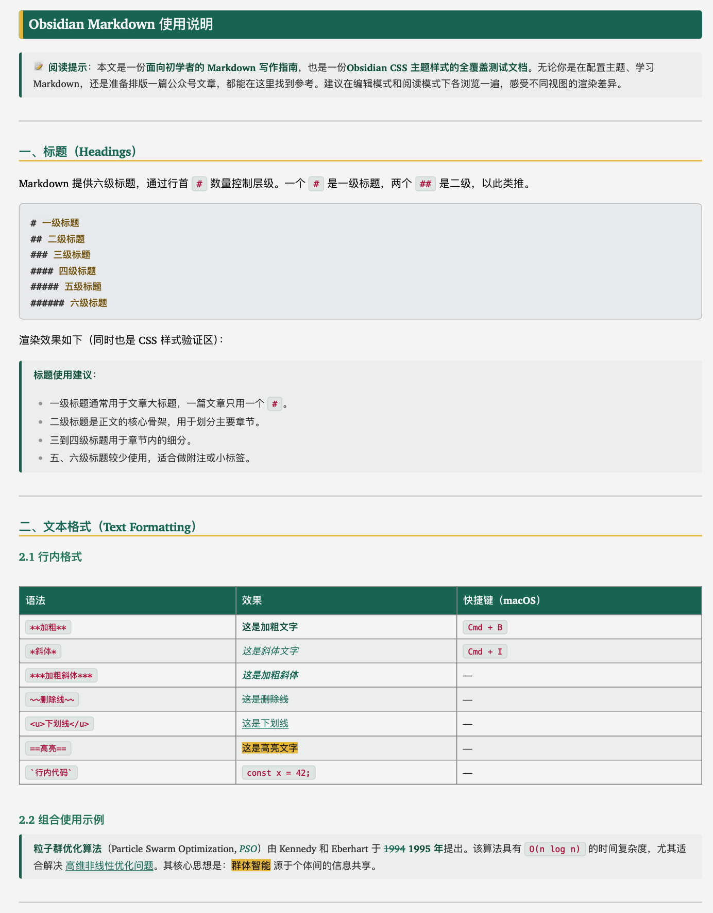

<h1 align="center">📝 Obsidian Standard Theme</h1>

<p align="center">
  <em>一个 CSS 文件，统一 Light / Dark / Print 三种模式。</em>
</p>

<p align="center">
  
  
  
</p>

---

## 📖 概述

**Obsidian Standard Theme** 是一个精心制作的 Obsidian CSS 样式片段，提供一套简洁、专业的绿色主题视觉风格。它完美适配 **浅色（Light）**、**深色（Dark）** 和 **打印/PDF（Print）** 三种模式，并在 **预览模式**（阅读）与 **源码/实时预览**（编辑）之间保持视觉一致性。

与完整的 Obsidian 主题不同，这是一个**单一 CSS 文件**——下载后放入 vault 的 snippets 文件夹并启用即可，无主题冲突，无需复杂配置。

> *English*: A single CSS snippet that unifies Light, Dark & Print modes for Obsidian. Just drop into your vault's snippets folder and enable.
>

<p align="center">
  
</p>

---

## ✨ 特性

| 特性 | 说明 |
|------|------|
| 🎨 **绿色调色板** | 优雅的从深青到薄荷绿的层级配色（#1a7a6a → #6aba9c） |
| ☀️🌙 **浅色/深色双模式** | 每种模式各有专属颜色变量，完美适配 |
| 🖨️ **打印/PDF 优化** | 使用 `print-color-adjust: exact` 确保导出时保留配色 |
| 📝 **预览与编辑统一** | H1–H6 在阅读模式和编辑模式下完全一致 |
| 🔤 **语法高亮** | 全覆盖所有主流语言的代码 Token 配色 |
| 📊 **精美表格** | 绿色表头、斑马纹、深色模式原生支持 |
| 💬 **优雅引用块** | 绿色左边框，浅色/深色/打印三模式均有柔和背景 |
| 🎯 **行内格式化** | 加粗、斜体、删除线、高亮——各有专属颜色 |
| 🔢 **行号支持** | 编辑器 gutter + Prism.js line-numbers 插件兼容 |
| 🌐 **中英双语注释** | CSS 代码全程配有中英文注释，方便学习和自定义 |

> 🖥 [在线效果预览](docs/preview.html) — 浏览器中打开，可实时切换浅色/深色模式。

---


## 🚀 快速安装

```bash
# 下载 CSS 文件至你的 vault 的 snippets 文件夹
curl -o <你的vault>/.obsidian/snippets/obsidian-standard.css \
  https://raw.githubusercontent.com/tsingke/obsidian-standard-theme/main/obsidian-standard.css
```

或手动安装：

1. **下载** [`obsidian-standard.css`](obsidian-standard.css) 文件
2. **复制** 到 `<你的vault>/.obsidian/snippets/`（macOS 按 `Cmd+Shift+.` 显示隐藏文件夹）
3. **启用**：设置 → 外观 → CSS 代码片段 → 刷新 → 打开 `obsidian-standard` 开关

> 📖 [详细安装指南](docs/installation.md)

---

## 📐 CSS 结构说明

`obsidian-standard.css`（约 1400 行）按功能划分为 16 个清晰的模块，方便定位和修改：

| 模块 | 行号 | 内容 |
|------|------|------|
| **1. 颜色变量** | L17–82 | 全局 CSS 自定义属性（`:root` 浅色 / `.theme-dark` 深色 / `@media print` 打印） |
| **2. 正文样式** | L239–265 | 笔记正文的字体、行高、颜色 |
| **3. 标题 — 预览模式** | L266–363 | H1–H6 在阅读模式下的完整样式（背景、边框、字号） |
| **4. 标题 — 编辑模式** | L364–426 | H1–H6 在源码/实时预览编辑模式下的样式 |
| **5. 行内格式 — 编辑模式** | L427–470 | 编辑模式下的加粗、斜体、删除线、链接颜色 |
| **6. 行内代码** | L471–507 | 行内代码的背景、文字色、圆角、字体 |
| **7. 代码块** | L508–818 | 代码块容器、语法高亮 Token（30+ 语言专属覆盖） |
| **8. 行内格式 — 预览模式** | L819–886 | 预览模式下的加粗、斜体、删除线等 |
| **9. 引用块** | L887–957 | `>` 引用块的左边框、背景、嵌套样式 |
| **10. 表格** | L958–1070 | 表头、斑马纹、边框、深色模式适配 |
| **11. 深色模式 — 行内格式** | L1071–1123 | 深色模式下的加粗、斜体等颜色覆盖 |
| **12. 图片** | L1124–1134 | 图片圆角和边距 |
| **13. 一致性问题修复** | L1135–1184 | 预览/编辑模式下样式不一致的修复补丁 |
| **14. 行号** | L1185–1276 | 编辑器行号 + Prism.js 行号插件样式 |
| **15. 代码块 CSS 变量** | L1277–1318 | Obsidian 内置代码渲染器的 `--code-*` 变量 |
| **16. Advanced Codeblock 兼容** | L1322–1411 | Advanced Codeblock 插件的行号兼容适配 |

> 💡 **自定义方法**：修改 **模块 1**（颜色变量）中的值即可快速更换整体配色方案。详见[docs/customization.md](docs/customization.md)。

---

## 🛠️ 快速自定义

所有主要颜色由 CSS 变量控制，找到 `:root`（浅色）和 `.theme-dark`（深色）段修改即可：

```css
:root {
  --heading-bg: #1a7a6a;       /* H1 背景色 */
  --heading-accent: #f2c94c;   /* H1 强调竖线 / H2 下划线 */
  --secondary-color: #2d8a6e;  /* H3 颜色 */
  --third-color: #3d9a78;      /* H4 颜色 */
  --fourth-color: #50aa88;     /* H5 颜色 */
  --fifth-color: #6aba9c;      /* H6 颜色 */
  --text-accent: #1a7a6a;      /* 链接、强调色 */
  --text-accent-strong: #0d5c4a; /* 加粗文字色 */
  --inline-bg: #eaf5f2;        /* 行内代码背景 */
  --inline-color: #0d5c4a;     /* 行内代码文字色 */
}
```

🔧 [完整自定义指南](docs/customization.md)

---

## 📂 项目结构

```
obsidian-standard-theme/
├── obsidian-standard.css      # 🎯 主 CSS 文件（核心！）
├── README.md                  # 本文件
├── LICENSE                    # MIT 许可证
├── CHANGELOG.md               # 版本历史
├── example/
│   ├── demo.png               # 🖼 README 中的示例演示图
│   ├── 范例.md                 # 完整 Markdown 测试文档（覆盖全部语法）
│   └── 范例.pdf                # PDF 导出参考（14 页）
├── docs/
│   ├── installation.md        # 安装指南（中英双语）
│   ├── customization.md       # 自定义指南（中英双语）
│   └── preview.html           # 🖥 浏览器交互预览（浅色/深色切换）
└── screenshots/
    └── hero-preview.svg       # README 老版预览图（可选）
```

---

## 📄 范例文档

仓库内含一份完整的 **[范例 Markdown 文档](example/范例.md)**，覆盖所有支持的元素类型：

- 全部 6 级标题
- 行内格式（加粗、斜体、代码、高亮等）
- 表格（含对齐方式）
- 代码块（Python / C++ / TypeScript / Bash / JSON / CSS）
- 引用块（单层、嵌套、内含元素）
- LaTeX 数学公式（行内 & 块级）
- Mermaid 图表（流程图、时序图、类图、甘特图、饼图）
- Callout 提示框（全部 12 种类型 + 可折叠）
- 脚注、标签、嵌入、转义字符、YAML 前置元数据

另有 [PDF 导出文件](example/范例.pdf) 可供参考——查看它在打印/导出模式下的实际渲染效果。

---

## ✅ 兼容性

| Obsidian 版本 | 状态 |
|:--------------|:-----|
| v1.8+ | ✅ 已充分测试 |
| v1.5 – v1.7 | ✅ 兼容 |
| v1.0 – v1.4 | ✅ 大概率可用 |
| < v1.0 | ⚠️ 不推荐 |

---

## 📄 许可证

[MIT](LICENSE) © [Tsingke](https://github.com/tsingke)

---

## 💬 支持

- ⭐ 如果觉得有用，请给本项目 Star！
- 🐛 [提交 Issue](https://github.com/tsingke/obsidian-standard-theme/issues) 报告 Bug 或请求功能
- 🔀 [提交 Pull Request](https://github.com/tsingke/obsidian-standard-theme/pulls)
- 💬 欢迎分享给 Obsidian 社区
