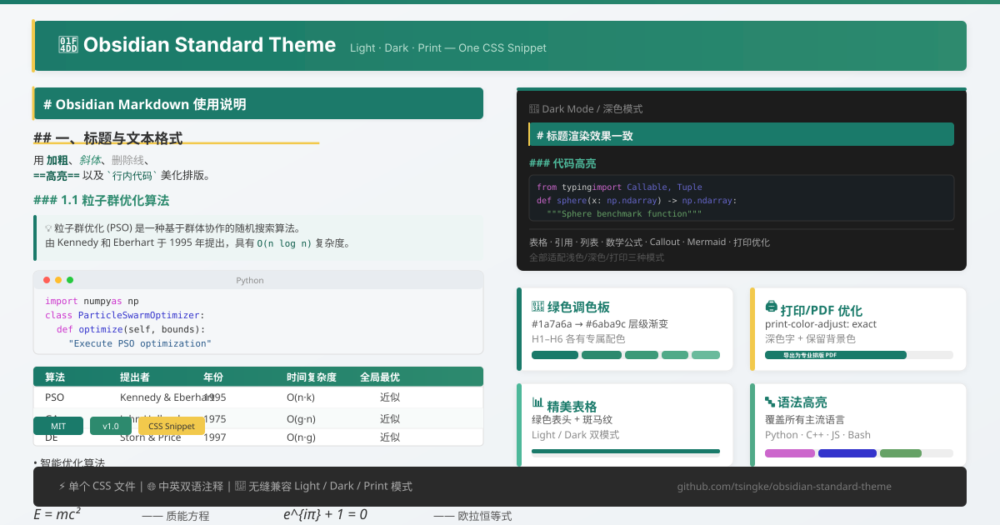

<p align="center">
  
</p>

<h1 align="center">📝 Obsidian Standard Theme</h1>

<p align="center">
  <em>One CSS snippet. Light, Dark &amp; Print modes unified. Bilingual documentation included.</em>
</p>

<p align="center">
  
  
  
</p>

---

## Overview

**Obsidian Standard Theme** is a meticulously crafted CSS snippet for [Obsidian](https://obsidian.md). It provides a clean, green-accented visual style that works seamlessly across **Light**, **Dark**, and **Print/PDF** modes — with consistent rendering between **Preview** (reading) and **Source / Live Preview** (editing) views.

Unlike full theme replacements, this is a **single CSS file** — just drop it into your vault's snippets folder and enable it. No theme conflicts, no complex setup.

> 中文概要：一款绿色主题的 Obsidian CSS 样式片段，统一 Light / Dark / Print 三种模式，预览和编辑风格一致。单个 CSS 文件，即装即用。

---

## Features

| Feature | Description |
|---------|-------------|
| 🎨 **Green Palette** | Elegant teal-to-mint heading hierarchy (#1a7a6a → #6aba9c) |
| ☀️🌙 **Light / Dark Mode** | Full support with dedicated color variables per mode |
| 🖨️ **Print / PDF Ready** | `print-color-adjust: exact` — exports with full color |
| 📝 **Preview + Editor Unified** | H1–H6 look identical in reading and editing views |
| 🔤 **Syntax Highlighting** | Comprehensive code token colors, all major languages |
| 📊 **Beautiful Tables** | Green headers, zebra stripes, dark mode native support |
| 💬 **Elegant Blockquotes** | Green left border, subtle background in all modes |
| 🎯 **Inline Formatting** | Bold, italic, strikethrough, highlight — each with dedicated color |
| 🔢 **Line Number Support** | Editor gutter + Prism.js line-numbers plugin compatible |
| 🌐 **Bilingual Comments** | All CSS documented in both Chinese and English |

> 💡 [Interactive Preview](docs/preview.html) — Open in your browser to see Light / Dark mode side by side.
>
> 💡 [在线效果预览](docs/preview.html) — 在浏览器中打开，可实时切换浅色/深色模式。

---

## Quick Install

```bash
# Download the CSS file into your vault's snippets folder
curl -o <your-vault>/.obsidian/snippets/obsidian-standard.css \
  https://raw.githubusercontent.com/tsingke/obsidian-standard-theme/main/obsidian-standard.css
```

Or manually:

1. **Download** [`obsidian-standard.css`](obsidian-standard.css) from this repo
2. **Copy** to `<your-vault>/.obsidian/snippets/` (press `Cmd+Shift+.` on macOS to reveal hidden folders)
3. **Enable** in Obsidian: Settings → Appearance → CSS snippets → Reload → Toggle `obsidian-standard` **on**

> 🖥️ [Detailed installation guide](docs/installation.md) · [详细安装指南](docs/installation.md)

---

## Quick Preview

Open **[docs/preview.html](docs/preview.html)** in any browser to see the theme in action — hit the ☀/🌙 toggle to switch between light and dark modes instantly. The preview demonstrates all core elements: headings, code blocks, tables, blockquotes, lists, callouts, and math formulas.

> 在浏览器中打开 `docs/preview.html`，点击☀/🌙按钮即可实时切换浅色/深色模式，预览所有核心元素。

---

## Customization

All major colors are controlled via CSS custom properties. Open `obsidian-standard.css` and look for the `:root` (Light) and `.theme-dark` (Dark) sections:

```css
:root {
  --heading-bg: #1a7a6a;       /* H1 background */
  --heading-accent: #f2c94c;   /* H1 accent bar / H2 underline */
  --secondary-color: #2d8a6e;  /* H3 color */
  --third-color: #3d9a78;      /* H4 color */
  --fourth-color: #50aa88;     /* H5 color */
  --fifth-color: #6aba9c;      /* H6 color */
  --text-accent: #1a7a6a;      /* Links, emphasis */
  --text-accent-strong: #0d5c4a; /* Bold text */
  --inline-bg: #eaf5f2;        /* Inline code background */
  --inline-color: #0d5c4a;     /* Inline code text */
}
```

🔧 [Full customization guide](docs/customization.md) · [完整自定义指南](docs/customization.md)

---

## Project Structure

```
obsidian-standard-theme/
├── obsidian-standard.css      # 🎯 Main CSS file — just copy this!
├── README.md                  # This file
├── LICENSE                    # MIT License
├── CHANGELOG.md               # Version history
├── example/
│   ├── 范例.md                 # Full Markdown example for CSS testing
│   └── 范例.pdf                # PDF export preview (14 pages)
├── docs/
│   ├── installation.md        # Detailed install guide (bilingual)
│   ├── customization.md       # Color & style customization (bilingual)
│   └── preview.html           # 🖥 Browser-based live preview (Light/Dark toggle)
└── screenshots/
    └── hero-preview.svg       # Hero image for this README
```

---

## Example Document

The repository includes a comprehensive **[example markdown document](example/范例.md)** (`example/范例.md`) that covers every supported element:

- All 6 heading levels
- Inline formatting (bold, italic, code, highlight)
- Tables with alignment options
- Code blocks in Python, C++, TypeScript, Bash, JSON, CSS
- Blockquotes (single, nested, with embedded elements)
- LaTeX math (inline & block)
- Mermaid diagrams (flowchart, sequence, class, Gantt, pie)
- Callouts (all 12 types including collapsible)
- Footnotes, tags, embeds, escape characters
- YAML frontmatter, HTML inline

The [PDF export](example/范例.pdf) is also available for reference — open it to see how the theme renders when printed or exported.

> 仓库内含一份[完整的 Markdown 范例文档](example/范例.md)，覆盖所有支持的元素类型。并附有 [PDF 导出文件](example/范例.pdf)供参考。

---

## Compatibility

| Obsidian Version | Status |
|:-----------------|:-------|
| v1.8+ | ✅ Fully tested |
| v1.5 – v1.7 | ✅ Compatible |
| v1.0 – v1.4 | ✅ Likely works |
| < v1.0 | ⚠️ Not recommended |

---

## License

[MIT](LICENSE) © [Tsingke](https://github.com/tsingke)

---

## Support

- ⭐ Star this repo if you find it useful!
- 🐛 [Open an issue](https://github.com/tsingke/obsidian-standard-theme/issues) for bugs or feature requests
- 🔀 [Submit a PR](https://github.com/tsingke/obsidian-standard-theme/pulls) with improvements
- 💬 Share with the Obsidian community
