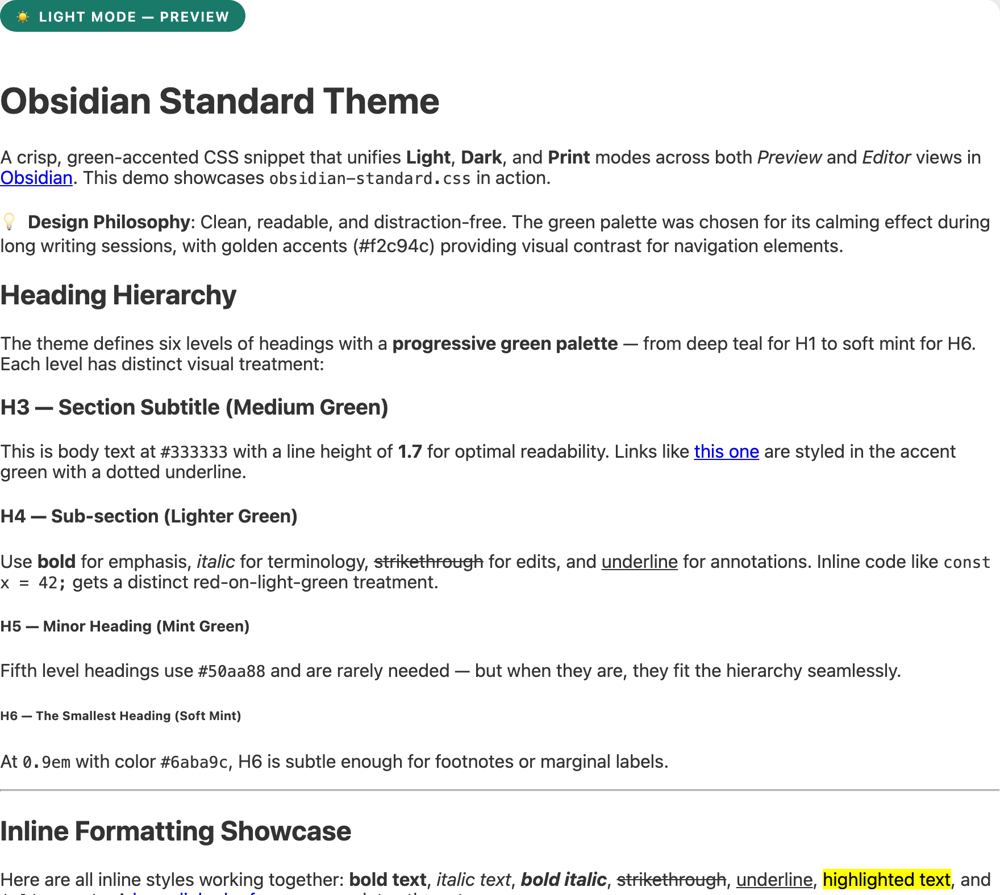
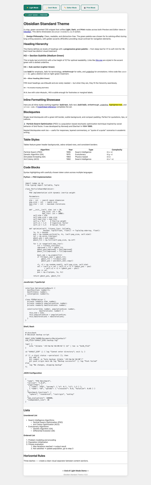
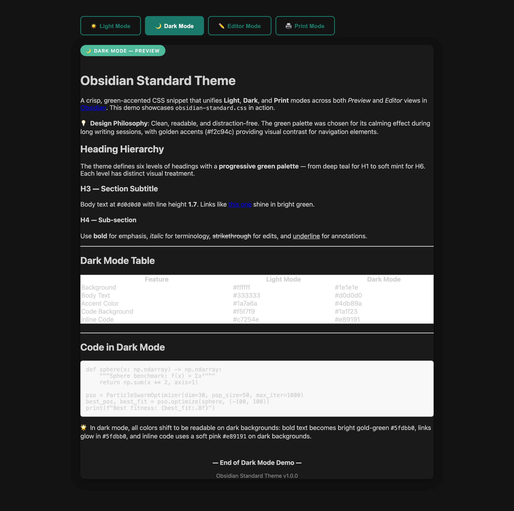
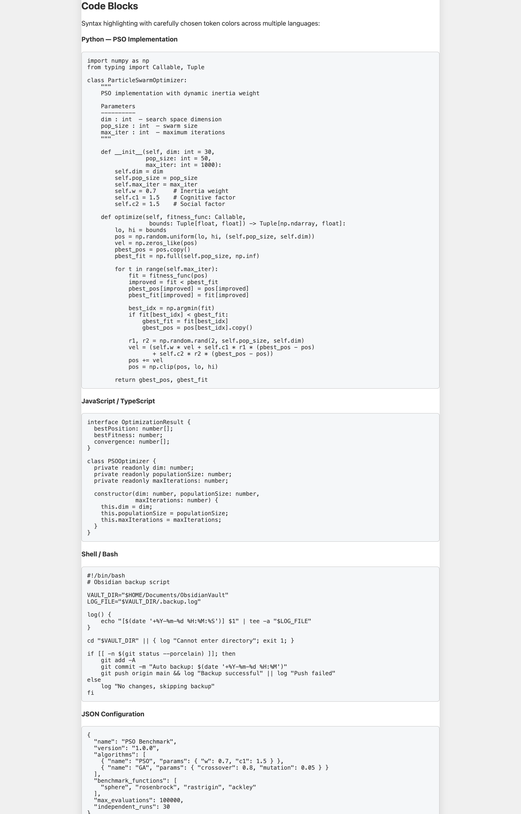
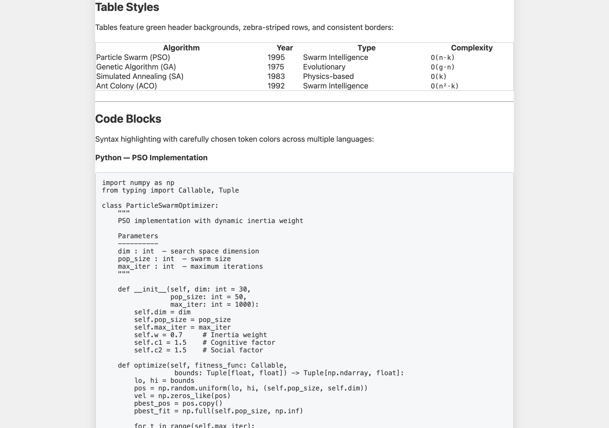
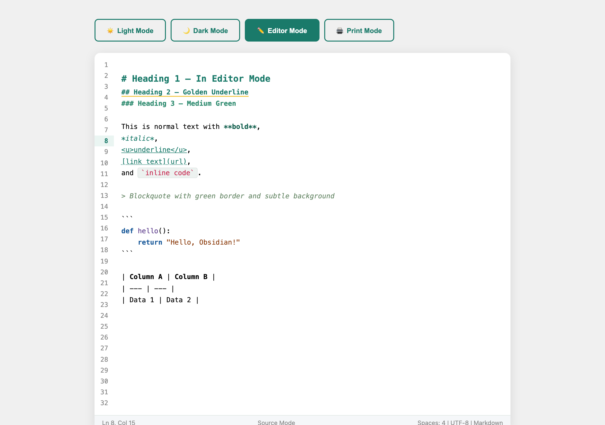
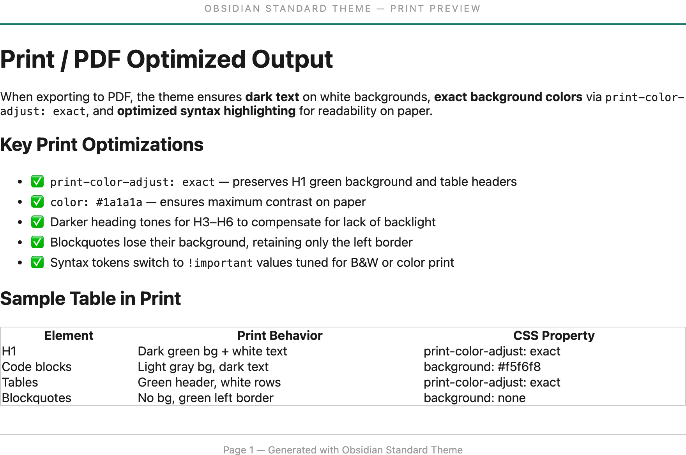

<p align="center">
  
</p>

<h1 align="center">📝 Obsidian Standard Theme</h1>

<p align="center">
  <em>A crisp, green-accented CSS snippet that unifies Light / Dark / Print modes for Obsidian</em><br>
  <em>一款清新的绿色主题 CSS 片段，统一 Obsidian 的 Light / Dark / Print 三种模式</em>
</p>

<p align="center">
  <a href="#-features">English</a> •
  <a href="#-特性">中文</a>
</p>

<hr>

<!-- ==========================================================================
     ENGLISH VERSION
     ========================================================================== -->

<h2 align="center">🌿 English</h2>

## 📖 Overview

**Obsidian Standard Theme** is a meticulously crafted CSS snippet for [Obsidian](https://obsidian.md). It provides a clean, professional green-accented visual style that works beautifully across **Light**, **Dark**, and **Print/PDF** modes, while ensuring visual consistency between **Preview** (reading) and **Source / Live Preview** (editing) views.

Unlike full theme replacements, this is a **single CSS file** — just drop it into your vault's snippets folder and enable it. No theme conflicts, no complex setup.

## ✨ Features

| Feature | Description |
|---------|-------------|
| 🎨 **Green Accent Palette** | Elegant teal-to-mint heading hierarchy (#1a7a6a → #6aba9c) |
| ☀️ **Light / Dark Mode** | Full support for both Obsidian themes with tailored colors |
| 🖨️ **Print / PDF Ready** | Optimized for export with `print-color-adjust: exact` |
| 📝 **Preview + Editor Unified** | Consistent H1–H6 styling in both reading and editing modes |
| 🔤 **Syntax Highlighting** | Comprehensive code token colors for all major languages |
| 📊 **Beautiful Tables** | Green headers, zebra stripes, dark mode support |
| 💬 **Elegant Blockquotes** | Green left border, subtle background in all modes |
| 🎯 **Inline Formatting** | Styled bold, italic, strikethrough, underline, links, and highlight |
| 🔢 **Line Numbers** | Editor gutter + Prism.js line-numbers plugin compatible |
| 🌐 **Bilingual Comments** | All CSS documented in both Chinese and English |

## 🚀 Installation

### Method 1: Manual (Recommended)

1. **Download** the `obsidian-standard.css` file from this repository
2. **Copy** it into your Obsidian vault's snippets folder:
   - `<your-vault>/.obsidian/snippets/`
   - (On macOS, press `Cmd+Shift+.` to reveal hidden folders)
3. **Enable** it in Obsidian:
   - Settings → Appearance → CSS snippets → Click the reload icon (↻)
   - Toggle `obsidian-standard` on

### Method 2: Obsidian BRAT (coming soon)

If you use the [BRAT](https://github.com/TfTHacker/obsidian42-brat) plugin, you can add this repository for automatic updates.

## 🎨 Screenshots

### Light Mode / 浅色模式



### Dark Mode / 深色模式



### Feature Highlights / 功能特写

| Code Blocks | Tables | Editor Mode | Print Preview |
|:---:|:---:|:---:|:---:|
|  |  |  |  |

> Click on any image to view full size. Screenshots captured using the [example markdown document](example/范例.md).

## 📂 Project Structure

```
obsidian-standard-theme/
├── obsidian-standard.css      # 🎯 Main CSS file — just copy this!
├── README.md                  # This file (bilingual)
├── LICENSE                    # MIT License
├── CHANGELOG.md               # Version history
├── example/
│   ├── 范例.md                 # Example markdown document for testing CSS
│   └── 范例.pdf                # PDF export of the example document
├── docs/
│   ├── installation.md        # Detailed installation guide (bilingual)
│   ├── customization.md       # How to customize colors (bilingual)
│   └── original-version.css   # Original unedited version
└── screenshots/               # 🖼️ Preview images (7 screenshots)
```

## 🛠️ Customization

The theme uses CSS custom properties (variables) for all major colors. To customize:

1. Open `obsidian-standard.css`
2. Find the `:root` section (Light mode) or `.theme-dark` section (Dark mode)
3. Change the color values to your liking:

```css
:root {
  --heading-bg: #1a7a6a;        /* H1 background color */
  --heading-accent: #f2c94c;    /* H1 accent bar / H2 underline */
  --secondary-color: #2d8a6e;   /* H3 color */
  /* ... more variables ... */
}
```

See [docs/customization.md](docs/customization.md) for detailed guidance.

## 📄 License

This project is licensed under the MIT License — see the [LICENSE](LICENSE) file for details.

## 🤝 Contributing

Contributions are welcome! Feel free to:
- Open an [issue](https://github.com/your-username/obsidian-standard-theme/issues) for bugs or feature requests
- Submit a [pull request](https://github.com/your-username/obsidian-standard-theme/pulls) with improvements

## 💬 Support

- Check the [FAQ](docs/installation.md#faq) for common questions
- Star ⭐ this repo if you find it useful!
- Share with the Obsidian community

---

<hr>

<!-- ==========================================================================
     CHINESE VERSION
     ========================================================================== -->

<h2 align="center">🌿 中文</h2>

## 📖 概述

**Obsidian Standard Theme** 是一个精心制作的 Obsidian CSS 样式片段。它提供了一种干净、专业的绿色主题风格，完美适配 **浅色**、**深色** 和 **打印/PDF** 三种模式，同时保证 **预览模式**（阅读）与 **源码/实时预览**（编辑）之间的视觉一致性。

与完整的主题替换方案不同，这是一个**单一的 CSS 文件**——只需将其放入你的知识库 snippets 文件夹并启用即可。无主题冲突，无需复杂配置。

## ✨ 特性

| 特性 | 说明 |
|------|------|
| 🎨 **绿色调色板** | 优雅的从深青到薄荷绿的标题层级配色（#1a7a6a → #6aba9c） |
| ☀️ **浅色/深色模式** | 完全支持 Obsidian 两种主题，各有专属配色 |
| 🖨️ **打印/PDF 优化** | 使用 `print-color-adjust: exact` 优化导出效果 |
| 📝 **预览+编辑统一** | H1–H6 在阅读和编辑模式下的样式完全一致 |
| 🔤 **语法高亮** | 覆盖所有主流语言的代码 Token 配色 |
| 📊 **精美表格** | 绿色表头、斑马纹、暗色模式支持 |
| 💬 **优雅引用块** | 绿色左边框，各模式下均有柔和背景 |
| 🎯 **行内格式** | 加粗、斜体、删除线、下划线、链接、高亮均有专属颜色 |
| 🔢 **行号支持** | 编辑器 gutter + Prism.js line-numbers 插件兼容 |
| 🌐 **双语注释** | 全部 CSS 代码均配有中英文注释 |

## 🚀 安装方法

### 方法一：手动安装（推荐）

1. **下载** 本仓库中的 `obsidian-standard.css` 文件
2. **复制** 到你的 Obsidian 知识库的 snippets 文件夹：
   - `<你的知识库>/.obsidian/snippets/`
   - （macOS 下按 `Cmd+Shift+.` 可显示隐藏文件夹）
3. **启用** 此样式：
   - 设置 → 外观 → CSS 代码片段 → 点击刷新图标 (↻)
   - 打开 `obsidian-standard` 的开关

### 方法二：通过 BRAT（即将推出）

如果你使用 [BRAT](https://github.com/TfTHacker/obsidian42-brat) 插件，可添加此仓库以获取自动更新。

## 🎨 截图预览

### 浅色模式


### 深色模式


### 功能特写

| 代码块 | 表格 | 编辑模式 | 打印预览 |
|:---:|:---:|:---:|:---:|
|  |  |  |  |

> 点击图片可查看原图。截图基于[范例文档](example/范例.md)生成。

## 📂 项目结构

```
obsidian-standard-theme/
├── obsidian-standard.css      # 🎯 主 CSS 文件 — 只需复制这一个！
├── README.md                  # 本文件（中英双语）
├── LICENSE                    # MIT 许可证
├── CHANGELOG.md               # 版本历史
├── example/
│   ├── 范例.md                 # 用于测试 CSS 的 Markdown 范例文档
│   └── 范例.pdf                # 范例文档的 PDF 导出
├── docs/
│   ├── installation.md        # 详细安装指南（中英双语）
│   ├── customization.md       # 自定义配色指南（中英双语）
│   └── original-version.css   # 原始未修改版本
└── screenshots/               # 🖼️ 预览截图（共 7 张）
```

## 🛠️ 自定义方法

本主题使用 CSS 自定义属性（变量）管理所有主要颜色。如需自定义：

1. 打开 `obsidian-standard.css`
2. 找到 `:root`（浅色模式）或 `.theme-dark`（深色模式）部分
3. 按需修改颜色值：

```css
:root {
  --heading-bg: #1a7a6a;        /* H1 背景色 */
  --heading-accent: #f2c94c;    /* H1 强调竖线 / H2 下划线 */
  --secondary-color: #2d8a6e;   /* H3 颜色 */
  /* ... 更多变量 ... */
}
```

详见 [docs/customization.md](docs/customization.md)。

## 📄 许可证

本项目基于 MIT 许可证开源 — 详见 [LICENSE](LICENSE) 文件。

## 🤝 贡献指南

欢迎贡献！你可以：
- 提交 [Issue](https://github.com/your-username/obsidian-standard-theme/issues) 报告 Bug 或请求新功能
- 提交 [Pull Request](https://github.com/your-username/obsidian-standard-theme/pulls) 改进代码

## 💬 支持

- 常见问题请查阅 [安装指南 FAQ](docs/installation.md#faq)
- 如果觉得有用，请给本项目 ⭐ Star！
- 欢迎分享给 Obsidian 社区
