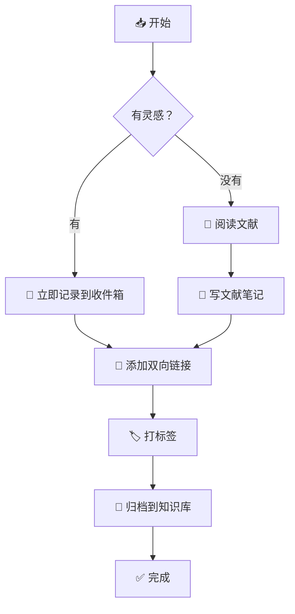
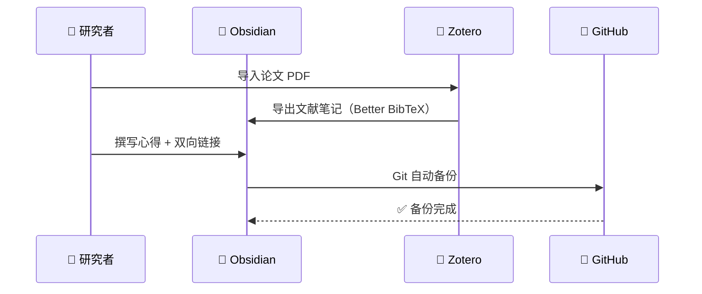
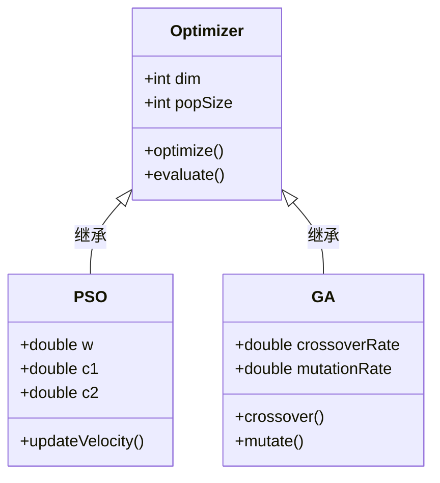
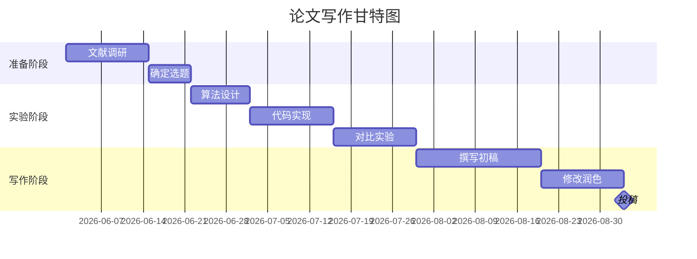
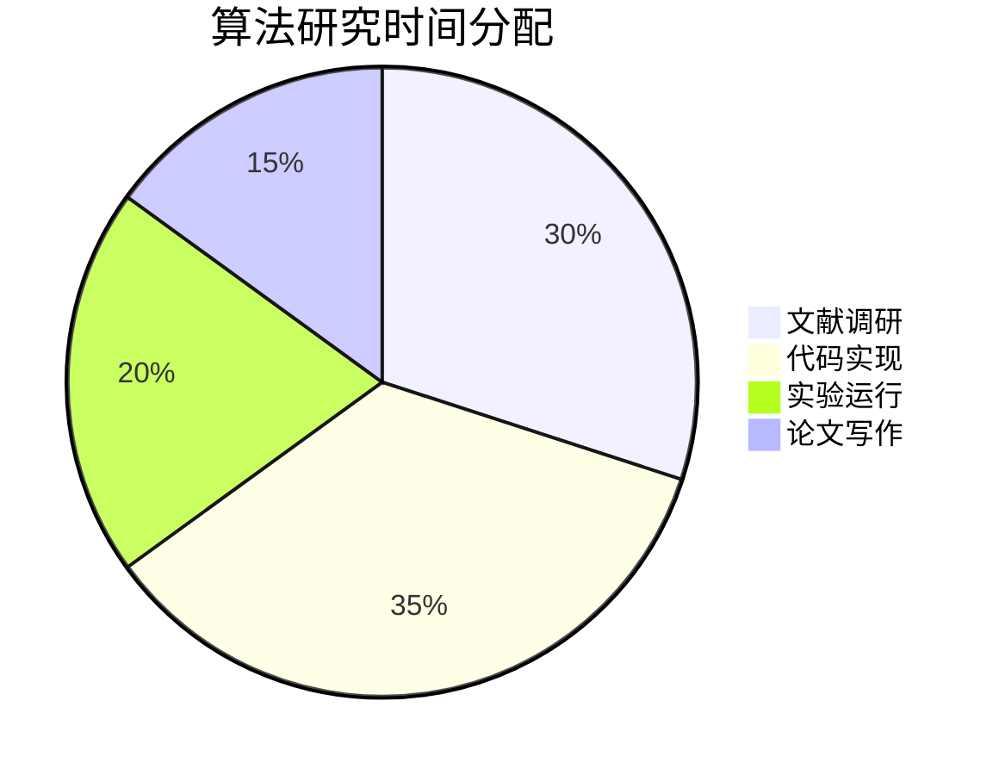
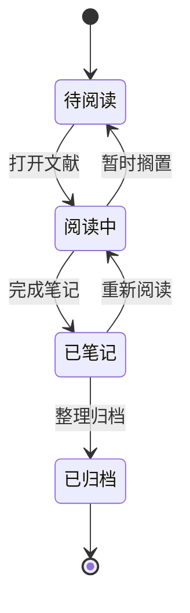

# Obsidian Markdown 使用说明

> 📝 **阅读提示**：本文是一份**面向初学者的 Markdown 写作指南**，也是一份**Obsidian CSS 主题样式的全覆盖测试文档**。无论你是在配置主题、学习 Markdown，还是准备排版一篇公众号文章，都能在这里找到参考。建议在编辑模式和阅读模式下各浏览一遍，感受不同视图的渲染差异。

---

## 一、标题（Headings）

Markdown 提供六级标题，通过行首 `#` 数量控制层级。一个 `#` 是一级标题，两个 `##` 是二级，以此类推。

```markdown
# 一级标题
## 二级标题
### 三级标题
#### 四级标题
##### 五级标题
###### 六级标题
```

渲染效果如下（同时也是 CSS 样式验证区）：

> **标题使用建议**：
> - 一级标题通常用于文章大标题，一篇文章只用一个 `#`。
> - 二级标题是正文的核心骨架，用于划分主要章节。
> - 三到四级标题用于章节内的细分。
> - 五、六级标题较少使用，适合做附注或小标签。

---

## 二、文本格式（Text Formatting）

### 2.1 行内格式

| 语法 | 效果 | 快捷键（macOS） |
|------|------|----------------|
| `**加粗**` | **这是加粗文字** | `Cmd + B` |
| `*斜体*` | *这是斜体文字* | `Cmd + I` |
| `***加粗斜体***` | ***这是加粗斜体*** | — |
| `~~删除线~~` | ~~这是删除线~~ | — |
| `<u>下划线</u>` | <u>这是下划线</u> | — |
| `==高亮==` | ==这是高亮文字== | — |
| `` `行内代码` `` | `const x = 42;` | — |

### 2.2 组合使用示例

> **粒子群优化算法**（Particle Swarm Optimization, *PSO*）由 Kennedy 和 Eberhart 于 ~~1994~~ **1995 年**提出。该算法具有 `O(n log n)` 的时间复杂度，尤其适合解决 <u>高维非线性优化问题</u>。其核心思想是：==群体智能== 源于个体间的信息共享。

---

## 三、链接与图片（Links & Images）

### 3.1 外部链接

```markdown
[显示文字](https://example.com)
[带提示的链接](https://obsidian.md "Obsidian 官网")
```

示例：[Obsidian 官网](https://obsidian.md)，[GitHub](https://github.com "全球最大的代码托管平台")。

### 3.2 内部链接（Wiki-Link）

Obsidian 的核心特性之一是双链笔记。使用 `[[笔记名]]` 可以链接到库中的其他笔记，使用 `#` 可以定位到标题。

| 语法 | 说明 |
|------|------|
| `[[笔记名]]` | 链接到另一篇笔记 |
| `[[笔记名\|显示文字]]` | 链接但显示别名 |
| `[[笔记名#标题]]` | 链接到笔记的某个标题 |
| `[[#当前笔记的标题]]` | 链接到当前笔记的某个标题 |

### 3.3 图片嵌入

```markdown
![[图片名.png]]

```

- `![[图片名.png]]` 是 Obsidian 的图片嵌入语法，将图片直接渲染在笔记中。
- `` 是标准 Markdown 的图片语法。

---

## 四、列表（Lists）

### 4.1 无序列表

使用 `-`、`*` 或 `+` 作为标记，层级间用两个空格或一个 Tab 缩进。

- 智能优化算法
  - 进化算法
    - 遗传算法（GA）
    - 差分进化（DE）
  - 群智能算法
    - 粒子群优化（PSO）
    - 蚁群优化（ACO）
- 机器学习方法
  - 监督学习
  - 无监督学习

### 4.2 有序列表

Markdown 有序列表会自动编号，无需手动维护数字。

1. 问题建模与编码
2. 种群初始化
3. 适应度评估
4. 终止条件判断
   1. 达到最大迭代次数 → 输出最优解
   2. 未满足条件 → 更新种群，返回步骤 3

### 4.3 任务列表

任务列表是 Obsidian 的扩展语法，非常适合做待办清单和项目管理。点击方框即可切换完成状态。

- [x] 📚 阅读 3 篇相关文献
- [x] 💻 完成算法代码实现
- [ ] 🧪 运行对比实验
- [ ] 📝 撰写论文初稿
- [ ] 📬 投稿至期刊

### 4.4 描述列表（Definition List）—— 部分主题支持

部分 Obsidian 主题支持 Markdown 的描述列表扩展语法：

🔬 粒子群优化（PSO）
: 一种基于群体协作的随机搜索算法，通过追随当前搜索到的最优值来寻找全局最优。

🔍 模拟退火（SA）
: 一种基于 Monte Carlo 迭代求解策略的随机寻优算法，模拟物理退火过程。

---

## 五、引用块（Blockquotes）

### 5.1 单层引用

> 💡 **Markdown 的设计哲学**：尽可能易读易写。可读性是最重要的设计目标——一份 Markdown 格式的文档应该能够以纯文本形式直接发布，而不给人感觉它被标记或格式指令填充过。

### 5.2 嵌套引用

> 第一层引用
>
> > 第二层嵌套引用
> >
> > > 第三层嵌套引用 —— 在学术笔记中，嵌套引用常用于表示"引用的引用"或逐层深入的讨论。

### 5.3 引用中的其他元素

> 引用块内可以包含多种元素：
>
> 1. **有序列表**
> 2. *斜体与加粗*
>
> ```python
> # 甚至是代码块
> print("Hello from inside a blockquote!")
> ```
>
> | 特性 | 支持 |
> |------|------|
> | 表格 | ✅ |
> | 代码 | ✅ |

---

## 六、代码（Code）

### 6.1 行内代码

在文本中使用 `` ` `` 包裹行内代码，例如：在终端执行 `npm install obsidian` 即可完成安装，修改 `appearance.json` 中的 `"theme"` 字段可以切换主题。

### 6.2 围栏代码块（Fenced Code Block）

使用三个反引号 ``` ``` ``` 包裹代码，并指定语言以获得语法高亮。以下是不同语言的渲染效果：

**Python 示例：**

```python 
import numpy as np
import matplotlib.pyplot as plt
from typing import Callable, Tuple

class ParticleSwarmOptimizer:
    """
    粒子群优化算法的 Python 实现
    
    Parameters
    ----------
    dim : int
        搜索空间维度
    pop_size : int
        种群规模（粒子数量）
    max_iter : int
        最大迭代次数
    """
    
    def __init__(self, dim: int = 30, pop_size: int = 50, max_iter: int = 1000):
        self.dim = dim
        self.pop_size = pop_size
        self.max_iter = max_iter
        self.w = 0.7   # 惯性权重
        self.c1 = 1.5  # 认知因子
        self.c2 = 1.5  # 社会因子
        
    def optimize(
        self, 
        fitness_func: Callable, 
        bounds: Tuple[float, float]
    ) -> Tuple[np.ndarray, float]:
        """执行优化并返回最优解与最优适应度"""
        lo, hi = bounds
        pos = np.random.uniform(lo, hi, (self.pop_size, self.dim))
        vel = np.zeros_like(pos)
        pbest_pos = pos.copy()
        pbest_fit = np.full(self.pop_size, np.inf)
        gbest_pos = np.zeros(self.dim)
        gbest_fit = np.inf
        
        for t in range(self.max_iter):
            fit = fitness_func(pos)
            improved = fit < pbest_fit
            pbest_pos[improved] = pos[improved]
            pbest_fit[improved] = fit[improved]
            
            best_idx = np.argmin(fit)
            if fit[best_idx] < gbest_fit:
                gbest_fit = fit[best_idx]
                gbest_pos = pos[best_idx].copy()
            
            r1, r2 = np.random.rand(2, self.pop_size, self.dim)
            vel = (self.w * vel + self.c1 * r1 * (pbest_pos - pos) 
                   + self.c2 * r2 * (gbest_pos - pos))
            pos += vel
            pos = np.clip(pos, lo, hi)
            
        return gbest_pos, gbest_fit


# ===== 使用示例 =====
def sphere(x: np.ndarray) -> np.ndarray:
    """Sphere 基准测试函数：f(x) = Σ x_i²"""
    return np.sum(x ** 2, axis=1)

pso = ParticleSwarmOptimizer(dim=30, pop_size=50, max_iter=1000)
best_pos, best_fit = pso.optimize(sphere, (-100, 100))
print(f"最优适应度：{best_fit:.8f}")
```

**C++ 示例：**

```cpp nums
#include <iostream>
#include <vector>
#include <random>
#include <algorithm>
#include <cmath>

struct Particle {
    std::vector<double> position;
    std::vector<double> velocity;
    std::vector<double> best_position;
    double best_fitness = std::numeric_limits<double>::max();
};

class PSO {
    int dim_, pop_size_, max_iter_;
    double w_, c1_, c2_;
    std::vector<Particle> swarm_;
    std::vector<double> gbest_position_;
    double gbest_fitness_ = std::numeric_limits<double>::max();
    
public:
    PSO(int dim, int pop_size, int max_iter)
        : dim_(dim), pop_size_(pop_size), max_iter_(max_iter),
          w_(0.7), c1_(1.5), c2_(1.5), swarm_(pop_size), gbest_position_(dim) {}
    
    void optimize(double (*f)(const std::vector<double>&),
                  double lo, double hi) {
        // 初始化粒子群...
        std::cout << "Optimization complete.\n";
    }
};
```

**JavaScript / TypeScript 示例：**

```typescript
interface OptimizationResult {
  bestPosition: number[];
  bestFitness: number;
  convergence: number[];
}

class PSOOptimizer {
  private readonly dim: number;
  private readonly populationSize: number;
  private readonly maxIterations: number;
  private readonly inertiaWeight: number = 0.7;
  private readonly cognitiveWeight: number = 1.5;
  private readonly socialWeight: number = 1.5;

  constructor(dim: number, populationSize: number, maxIterations: number) {
    this.dim = dim;
    this.populationSize = populationSize;
    this.maxIterations = maxIterations;
  }

  optimize(fitnessFunc: (x: number[]) => number, 
           bounds: [number, number]): OptimizationResult {
    const convergence: number[] = [];
    // ... 优化逻辑
    return {
      bestPosition: Array(this.dim).fill(0),
      bestFitness: 0,
      convergence,
    };
  }
}
```

**Shell / Bash 示例：**

```bash
#!/bin/bash
# Obsidian 备份脚本 —— 每天自动将 vault 推送到远程 Git 仓库

VAULT_DIR="$HOME/Documents/ObsidianVault"
LOG_FILE="$VAULT_DIR/.backup.log"

log() {
    echo "[$(date '+%Y-%m-%d %H:%M:%S')] $1" | tee -a "$LOG_FILE"
}

cd "$VAULT_DIR" || { log "❌ 无法进入目录"; exit 1; }

if [[ -n $(git status --porcelain) ]]; then
    git add -A
    git commit -m "📦 Auto backup: $(date '+%Y-%m-%d %H:%M')"
    git push origin main && log "✅ 备份成功" || log "❌ 推送失败"
else
    log "⏭️  无变更，跳过备份"
fi
```

**JSON / YAML 配置示例：**

```json
{
  "name": "Particle Swarm Optimization Benchmark",
  "version": "1.0.0",
  "algorithms": [
    { "name": "PSO", "parameters": { "w": 0.7, "c1": 1.5, "c2": 1.5 } },
    { "name": "GA", "parameters": { "crossover_rate": 0.8, "mutation_rate": 0.05 } },
    { "name": "DE", "parameters": { "F": 0.5, "CR": 0.9 } }
  ],
  "benchmark_functions": ["sphere", "rosenbrock", "rastrigin", "ackley", "griewank"],
  "max_evaluations": 100000,
  "independent_runs": 30
}
```

**CSS 样式片段（Obsidian Snippet）：**

```css
/* === Obsidian 主题美化片段 === */

/* 一级标题：居中 + 底部装饰线 */
.markdown-preview-view h1,
.cm-header-1 {
  text-align: center;
  font-size: 2em;
  color: var(--h1-color);
  border-bottom: 2px solid var(--accent-color);
  padding-bottom: 0.5em;
  margin-bottom: 1em;
}

/* 行内代码：圆角 + 柔和背景 */
.markdown-preview-view code,
.cm-inline-code {
  background-color: var(--code-background);
  color: var(--code-normal);
  border-radius: 4px;
  padding: 0.15em 0.4em;
  font-family: "JetBrains Mono", "Fira Code", monospace;
  font-size: 0.9em;
}

/* 代码块：更舒适的边距与阴影 */
.markdown-preview-view pre {
  border-radius: 8px;
  box-shadow: 0 2px 8px rgba(0, 0, 0, 0.1);
  margin: 1.5em 0;
}
```

---

## 七、表格（Tables）

### 7.1 基础表格

表格使用 `|` 分隔列，第二行的 `---` 定义列对齐：

| 算法名称 | 提出者 | 年份 | 时间复杂度 | 全局最优 |
| :------- | :----- | :--: | ---------: | :------: |
| PSO | Kennedy & Eberhart | 1995 | $O(n \cdot k)$ | 近似 |
| GA | John Holland | 1975 | $O(g \cdot n)$ | 近似 |
| SA | Kirkpatrick et al. | 1983 | $O(k)$ | 概率保证 |
| DE | Storn & Price | 1997 | $O(n \cdot g)$ | 近似 |
| ACO | Marco Dorigo | 1992 | $O(n^2 \cdot k)$ | 近似 |

> **对齐规则**：`---` 默认左对齐，`:---` 左对齐，`:---:` 居中，`---:` 右对齐。

### 7.2 含代码与公式的表格

| 语言 | Hello World | 运行方式 |
| :--- | :---------- | :------- |
| Python | `print("Hello, World!")` | `python main.py` |
| JavaScript | `console.log("Hello, World!");` | `node index.js` |
| C++ | `std::cout << "Hello, World!";` | `g++ -o app main.cpp` |
| MATLAB | `disp('Hello, World!')` | 在命令窗口直接运行 |

---

## 八、数学公式（LaTeX Math）

Obsidian 内置 MathJax 渲染引擎，支持用 `$...$` 书写行内公式、用 `$$...$$` 书写块级公式。

### 8.1 行内公式

- 质能方程 $E = mc^2$ 揭示了质量与能量的等价性。
- 欧拉恒等式 $e^{i\pi} + 1 = 0$ 被誉为"数学中最美的公式"。
- 向量表示 $\mathbf{x} \in \mathbb{R}^n$ 常见于优化问题中。
- 概率表达 $P(A \mid B) = P(A)$ 当且仅当 $A$ 与 $B$ 独立。

### 8.2 块级公式

**标准正态分布的概率密度函数：**

$$
f(x) = \frac{1}{\sigma\sqrt{2\pi}} \exp\left(-\frac{(x - \mu)^2}{2\sigma^2}\right)
$$

**粒子群速度更新公式（核心方程）：**

$$
\mathbf{v}_i^{t+1} = \omega \mathbf{v}_i^t + c_1 r_1 (\mathbf{p}_i - \mathbf{x}_i^t) + c_2 r_2 (\mathbf{g} - \mathbf{x}_i^t)
$$

其中 $\omega$ 为惯性权重，$c_1,c_2$ 为学习因子，$r_1,r_2 \sim U(0,1)$ 为随机数。

**贝叶斯定理的连续形式：**

$$
P(\theta \mid \mathcal{D}) = \frac{P(\mathcal{D} \mid \theta) \, P(\theta)}{\int P(\mathcal{D} \mid \theta') \, P(\theta') \, d\theta'}
$$

**多行对齐公式：**

$$
\begin{aligned}
\nabla \times \mathbf{E} &= -\frac{\partial \mathbf{B}}{\partial t} \\[4pt]
\nabla \times \mathbf{B} &= \mu_0 \mathbf{J} + \mu_0 \varepsilon_0 \frac{\partial \mathbf{E}}{\partial t}
\end{aligned}
$$

**矩阵表示：**

$$
\mathbf{W} = 
\begin{bmatrix}
w_{11} & w_{12} & \cdots & w_{1n} \\
w_{21} & w_{22} & \cdots & w_{2n} \\
\vdots & \vdots & \ddots & \vdots \\
w_{m1} & w_{m2} & \cdots & w_{mn}
\end{bmatrix}
$$

---

## 九、分隔线（Horizontal Rules）

三个或以上的 `-`、`*` 或 `_` 构成一条分隔线，用于在视觉上分割内容段落。

---

上面是一条使用 `---` 分隔线。

***

上面是一条使用 `***` 分隔线。

___

上面是一条使用 `___` 分隔线。

> 💡 **小贴士**：推荐使用 `---`，因为这是最通用的写法。注意 `---` 紧接在文字下方时会被解析为 Setext 二级标题，而不是分隔线——在 `---` 上方留一个空行即可避免。

---

## 十、注释（Comments）

Markdown 本身不提供注释语法，但可以使用 HTML 注释 `<!-- 这是注释 -->`。注释在渲染视图中完全不可见，在编辑模式下可以看到。

<!-- 这是一条注释，在阅读模式下你看不到我，但在编辑模式下可以看到 -->

<!-- 
  ⚠️ 多行注释在这里
  适合写待办提醒、草稿备忘等不想在发布时展示的内容
-->

---

## 十一、脚注（Footnotes）

脚注用于补充说明而不打断正文阅读流。[^1] Obsidian 支持标准 Markdown 脚注语法。[^obsidian]

[^1]: 这是第一条脚注的详细说明。脚注通常出现在页面底部，提供引用来源或补充信息。

[^obsidian]: **Obsidian** 是一款基于本地 Markdown 文件的知识管理工具，由 Shida Li 和 Erica Xu 于 2020 年推出。它被称为"你的第二大脑"。

在正文中使用 `[^标识符]` 引用，在文末用 `[^标识符]: 内容` 定义。标识符可以是数字或单词。

---

## 十二、标签（Tags）

Obsidian 支持两种标签写法：

- **行内标签**：在正文中用 `#标签名` 添加标签，例如 #obsidian #markdown #教程
- **嵌套标签**：用 `/` 创建层级标签，例如 #算法/群智能/PSO #编程/Python

在正文中插入的标签在阅读模式下会被渲染为可点击的样式，点击后可按标签过滤笔记。

---

## 十三、Callout 提示框

Callout 是 Obsidian 专属的高亮提示语法，在标准 Markdown 中不存在。语法格式为 `> [!类型] 标题`。

> [!note] 基础笔记
> 这是最常用的 Callout 类型，用于补充说明或记录要点。

> [!info] 你知道吗？
> Obsidian 支持 **12 种** 内置 Callout 类型，并且可以通过 CSS 自定义外观。

> [!tip] 效率技巧
> 输入 `> [!` 后 Obsidian 会自动弹出 Callout 类型选择列表，按 `↑↓` 选择，`Enter` 确认。

> [!success] 正确做法
> 每天花 5 分钟整理当日笔记，建立链接，让知识点之间形成网络。

> [!question] 思考题
> 如果一篇笔记没有任何链接，它还算是"第二大脑"中的神经元吗？

> [!warning] 注意
> 在 Obsidian 的 Callout 中，第一行以上的内容不会被折叠。折叠功能仅在 `+` 或 `-` 与 Callout 结合时生效。

> [!danger] 重要提醒
> 不要直接在系统文件管理器中移动或删除 `.obsidian` 文件夹！这可能导致插件和配置丢失。

> [!example] 举个栗子 🌰
> 
> 一个研究生的 Obsidian 笔记结构可能是这样：
> 
> ```
> Vault/
> ├── 00.收件箱/        ← 快速记录，然后整理
> ├── 10.文献笔记/      ← 论文阅读笔记
> ├── 20.项目笔记/      ← 实验记录与分析
> ├── 30.领域知识/      ← 长期积累的知识体系
> └── 40.日常/          ← 日记与周报
> ```

> [!quote] 引用名言
> "We are overwhelmed with information and starved for wisdom." — E.O. Wilson

> [!abstract] 摘要
> 本文系统梳理了 Obsidian Markdown 的全部语法元素，包括基础文本格式、列表、表格、代码块、数学公式、Callout、Mermaid 图表等，是 Obsidian 写作的完整参考手册。

### 可折叠 Callout

在类型后面加 `+`（默认展开）或 `-`（默认折叠）：

> [!tip]- 点击展开：关于标题层级的建议
> 一级标题（`#`）像一本书的书名——一本只有一个。
> 二级标题（`##`）像书的章节——架构文章的主干。
> 三级标题（`###`）像章节的小节——细化讨论点。
> 四级及以下——用得太频繁说明该拆分笔记了。

---

## 十四、YAML 前置元数据（Frontmatter）

每篇 Obsidian 笔记顶部都可以用 YAML 格式存储元数据，用两个 `---` 包裹：

```yaml
---
title: 我的笔记标题
date: 2026-06-04
tags: [obsidian, markdown]
aliases: ["别名1", "别名2"]
cssclasses: [custom-css-class]
---
```

这些元数据可被 Dataview 插件查询、用于模板变量替换、或在图谱视图中展示。

> [!info] 常见属性字段
> | 字段 | 用途 |
> | :--- | :--- |
> | `title` | 笔记标题（可不同于文件名） |
> | `date` | 创建或修改日期 |
> | `tags` | 标签列表 |
> | `aliases` | 别名（影响内部链接匹配） |
> | `cssclasses` | 应用自定义 CSS 类 |
> | `publish` | 控制是否发布到 Obsidian Publish |

---

## 十五、嵌入内容（Embeds）

### 15.1 嵌入笔记

使用 `![[笔记名]]` 可以将一篇笔记**全文嵌入**到当前笔记中。这是 Obsidian 的独有杀手级功能。

例如，如果你有一篇笔记叫 `PSO参数调优经验`，在当前笔记中写 `![[PSO参数调优经验]]` 就会将其内容直接展开。

### 15.2 嵌入图片

```
![[架构图.png]]
![[架构图.png|300]]        ← 指定宽度 300px
```

### 15.3 嵌入音频

```
![[录音.mp3]]
```

### 15.4 嵌入视频

```
![[演示视频.mp4]]
```

---

## 十六、转义字符（Escaping）

当 Markdown 语法字符需要作为普通文字显示时，在前面加反斜杠 `\`。

| 转义前 | 转义后 | 说明 |
| :--- | :--- | :--- |
| `*斜体*` | `\*斜体\*` | 防止星号被解析 |
| `# 标题` | `\# 标题` | 防止被解析为标题 |
| `[文字]` | `\[文字\]` | 防止被解析为链接 |
| `` `代码` `` | `` \`代码\` `` | 防止被解析为行内代码 |

> 💡 **实用场景**：当你在正文中写 `第3步：更新速度 v_i(t+1)` 而 `_i` 被误解析为斜体时，改写为 `v\_i(t+1)` 即可。

---

## 十七、Mermaid 图表

Obsidian 原生支持 Mermaid，可以在代码块中绘制多种类型的图表。这是生成架构图、流程图、时序图的最佳方式——无需任何插件。

### 17.1 流程图（Flowchart）



### 17.2 时序图（Sequence Diagram）



### 17.3 类图（Class Diagram）



### 17.4 甘特图（Gantt Chart）



### 17.5 饼图（Pie）与 状态图（State Diagram）





---

## 十八、HTML 内嵌（HTML Content）

当 Markdown 无法满足排版需求时，可以直接在 Markdown 文件中书写 HTML（部分场景在 Obsidian 阅读模式下生效）。

**上标与下标：** H<sub>2</sub>O 是水的化学式，2<sup>10</sup> = 1024。

**键盘按键：** 在 macOS 上按 <kbd>Cmd</kbd> + <kbd>Shift</kbd> + <kbd>P</kbd> 打开命令面板。

**文本居中：**

<div align="center">
<p><strong>—— 全文完 ——</strong></p>
<p><em>感谢阅读，祝你 Obsidian 之旅愉快 🎉</em></p>
</div>

---

## 附录：快速参考卡

| 元素 | 语法 | 速记 |
| :--- | :--- | :--- |
| 标题 | `# H1` ~ `###### H6` | `#` 数量 = 层级 |
| 加粗 | `**文字**` | `Cmd + B` |
| 斜体 | `*文字*` | `Cmd + I` |
| 删除线 | `~~文字~~` | 波浪线 |
| 高亮 | `==文字==` | 等号 |
| 行内代码 | `` `代码` `` | 反引号 |
| 代码块 | ` ```语言 ` | 三个反引号 |
| 引用 | `> 内容` | 大于号 |
| 无序列表 | `- 项目` | 减号 + 空格 |
| 有序列表 | `1. 项目` | 数字 + 点 + 空格 |
| 任务列表 | `- [ ] 任务` | 减号 + 方括号 |
| 分隔线 | `---` | 三个减号 |
| 链接 | `[文字](url)` | 方括号 + 圆括号 |
| 图片 | `` | 感叹号 + 链接 |
| 内部链接 | `[[笔记名]]` | 双方括号 |
| Callout | `> [!类型]` | 大于号 + 感叹号 + 方括号 |
| 标签 | `#标签名` | 井号 |
| 公式 | `$E=mc^2$` | 美元符号 |
| 脚注 | `[^标识]` | 方括号 + 脱字符 |
| Mermaid | ` ```mermaid ` | 代码块指定语言为 mermaid |

> [!tip] 最后的话
> Markdown 的学习曲线非常平缓——掌握上述 90% 的语法只需要一个下午，但它们能支撑你未来十年的知识管理旅程。**Obsidian 更像是一种思维习惯**：用链接代替文件夹，用标签代替分类，让知识在网络中自然生长。
>
> 如果你正在调校你的 Obsidian CSS 主题，建议将本文在**浅色模式**和**深色模式**下各浏览一遍，并用 `Cmd + E` 在编辑/阅读视图之间切换，确保所有元素的样式都符合预期。


